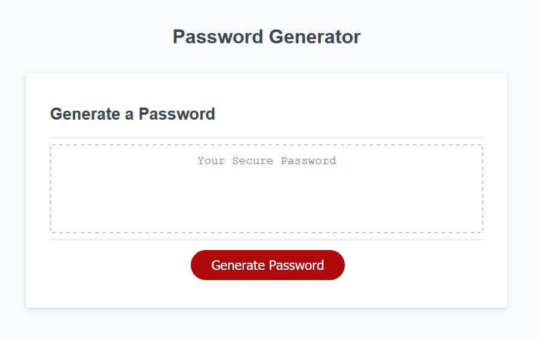

<h1 align="center">Kevin Kim's Password Generator</h1>

<!-- TABLE OF CONTENTS -->

  
Table of Contents

  <ol>
    <li>
      <a href="#about-the-project">About The Project</a>
      <ul>
        <li><a href="#built-with">Built With</a></li>
      </ul>
    </li>
    <li>
      <a href="#links">Links</a>
    <li><a href="#screenshot">Screenshot</a></li>
  </ol>

## About The Project

This repository contains the code for a random password generator website. This website allows an employee with access to sensitive data, randomly generate a password that meets a certain criteria so that they can create a strong password that can provide them with greater security.

This generator enables employees to generate random passwords based on criteria that they've selected. This app will run in the browser and will feature dynamically updated HTML and CSS powered by Javascript code that has been written.

## Built With

- [HTML](https://html.spec.whatwg.org/)
- [CSS](https://www.w3.org/Style/CSS/Overview.en.html)
- [Javascript](https://www.javascript.com/)

## Links

- [Website](https://kimshihyun.github.io/password-generator/)
- [Github Repo](https://github.com/KimShiHyun/password-generator/)

## Screenshot

The following image shows the web application's appearance and functionality:

